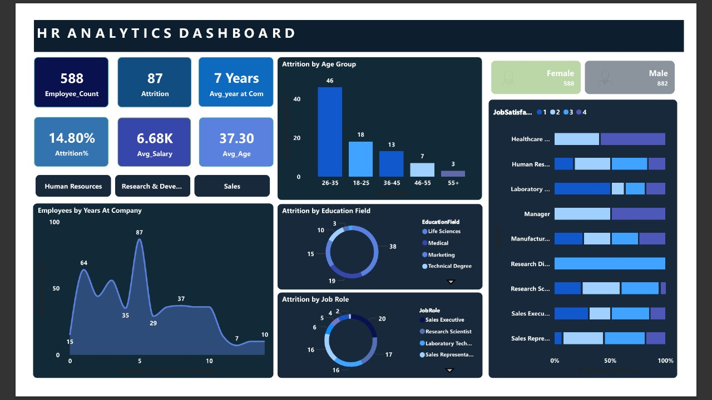

# HR-Analysis

## HR Analytics Overview

### Introduction
This analytics project was undertaken to investigate employee attrition within an organization. The primary objective was to identify key factors influencing attrition and recommend actionable solutions to mitigate it. The project followed a structured approach involving project scoping, data collection and cleaning, visualization through Power BI, reporting key insights, implementing strategies, and monitoring outcomes.

### Project Objectives

• Analyze the IBM HR Dataset

• Prepare and clean the dataset for analysis

• Use Power BI to visualize and interpret attrition trends, including:

   • Attrition by Education Field

   • Attrition by Age Group

   • Attrition by Job Role

   • Attrition by Job Role and Job Satisfaction

   • Employee tenure (Years at Company)

### Dashboard Insights
Separate dashboards were created for male and female employees to observe gender-based attrition patterns.
## HR Analytics Dashboard

### Female Employees

### Male Employees

### Key Findings from HR Attrition Analysis

• The dataset contains information for 1,470 employees, spanning various departments and job roles across the organization.

• The average salary among employees was approximately ₹6.5K.

• The average employee age was 37 years, with an average tenure of 7 years.

• A total of 237 employees left the company, resulting in an overall attrition rate of 16%.

• The highest attrition was observed among employees aged 26–35, particularly among males, with 70 individuals leaving — accounting for 19.02% of all attrition.

Insight: This group had an average salary of ₹4.82K, which may be a contributing factor to their decision to leave.
The Research & Development department recorded the highest attrition, with 133 employees exiting, especially among Library Technicians and Research Scientists.

Insight: The average salary for employees in these roles was found to be just ₹3.24K, which could explain the higher turnover rate in this department.

## Root Causes and Recommended Solutions

### Factor	Insight	Proposed Solution
• Employment Duration - Majority of attrition happens within the first few years.  
       Solution : Implement regular check-ins and performance reviews to support early-career employees. 
• Age - Younger employees exhibit higher attrition rates.  
       Solution : Provide career development programs to retain younger talent. 
• Department - R&D experiences the highest attrition. 
       Solution : Address workload, communication gaps, and limited growth opportunities. 
• Job Role - Laboratory Technicians face the highest attrition. 
       Solution : Conduct exit interviews or surveys to identify and resolve underlying concerns. 
 
### Conclusion
• Organizations can significantly reduce attrition and enhance employee satisfaction by taking a data-driven approach to HR management.

• By closely analyzing attrition trends and workforce dynamics, companies can adapt their HR policies, improve compensation and benefits, and invest in employee development.

• Fostering a supportive, growth-oriented workplace culture not only improves employee retention but also boosts overall organizational performance. Employees who feel valued and engaged are more likely to stay, contribute effectively, and support the company’s long-term success.
